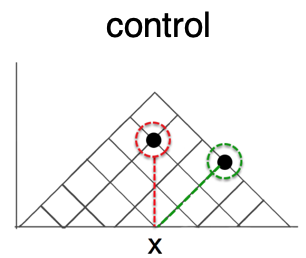
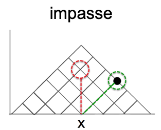

\newpage  

```{r SETUP, include=FALSE}
knitr::opts_chunk$set(echo = TRUE, warning = FALSE, message = FALSE) 
# knitr::opts_chunk$set(tidy.opts=list(width.cutoff=80),tidy=TRUE)

#IMPORT LIBRARIES
library(tidyverse) #ALL THE THINGS


#visualization
library(ggdist) #distribution visualizations
library(ggpubr) #arrange plots


# library(rmdformats)
library(tables) #tables, begrudingly

# library(pastecs) #stat.desc
library(mosaic) #simple descriptives [favstats]
library(ggplot2) #graphs
#library(rstatix) #nice effsizes https://rpkgs.datanovia.com/rstatix/index.html
library(effectsize) #effect size
# library(fitdistrplus) #fitting theoretical distributions

library(see) #pubready plots, esp. violin

# library(pwr) #power analysis
```

# INTRODUCTION
<br>
In Study 3A we explore a hypothesis that emerged from analysis of Study 2, namely that <b>presenting a learning with a situation that induces a state of impasse will increase the probability they have a moment of insight</b>. 

In the context of Study 2, an impasse state was (unintentionally) induced when the combination of question + data set yielded no available answer in the incorrect (cartesian) interpretation of the graph.  In Study 3A, we test this hypothesis by comparing performance between a (treatment) group receiving impasse-inducing questions followed by normal questions, and a non-impasse control. 
<br>





<br>

## Hypotheses 

H1. Learners posed with impasse-inducing questions will be _more likely_ to correct interpret the graph.  
H0. Learners posed with impasse-inducing questions will be _no more likely_ to correctly interpret the graph.


```{r}
#FOR PUBLIC WEB VERSION
# --- 
# **To try the study yourself: **
# visit TODO INSERT LINK     
# *Enter "github" as your session code, and number of the condition you wish to test*    
# session code= GITHUB
# condition code for CONTROL = 111
# condition code for IMPASSE = 121
# <br> <br>
```  

# METHODS
## Design
We employed a mixed design with 1 between-subjects factor with 2 levels (Scaffold: control, impasse) and 15 items (within-subjects factor). 

Independent Variables:  
- B-S (Scaffold: control,impasse)  
- W-S (Item x 15)

Dependent Variables:  
- Response Accuracy : Is the response triangular-correct? 0 (false), 1 (true)  
- Response Latency : Time from stimulus onset to clicking 'Submit' button: time in (s)  
- (derived) Interpretation : With which interpretation of the graph is the subject's response on an individual question consistent? 

**TODO: ADD context on scoring algorithm when done **

### Materials
Stimuli consisted of a series of 15 graph comprehension questions, each testing a different combination of time interval relations, to be read from a Triangular-Model graph. In both conditions, the questions were identical. Participants in the IMPASSE condition saw a graph with a slightly different dataset, such that the some of the questions posed an IMPASSE structure, where no datapoint intersects the orthogonal projection from the x-axis required if reading the graph in accordance with the cartesian coordinate system. The complete list of questions can be found
<!--html_preserve--><a href="static/sgcx_questions.csv" target="_blank">here</a><!--/html_preserve-->. Examples of graphs+datasets stimuli for each condition are depicted below. 

_The green line indicates the ideal-scanpath to the correct (triangular) answer to the first question, and the red line indicates the (incorrect) orthogonal interpretation. In the IMPASSE figure (at right), there are no data points that intersect the red line._
<br>

 
**TODO FIX PICTURE SIZE ON PDF**

### Procedure

Participants completed the study via a web-browser. Upon starting, they submitted informed consent, before reading task instructions. Participants were introduced to a scenario in which they were to play the role of a project manager, scheduling shifts for a group of employees. The schedule of the employees was presented in a TriangularModel (TM) graph, and they would be answering question about the schedule. Then participants completed a test block of 15 items. In the IMPASSE condition, the first five questions included an IMPASSE problem state. For participants in the CONTROL condition, the dataset was structure such that there was always an available 'orthogonal answer' for the first 5 questions.  In both conditions, the remaining 10 questions were not structured as impasse.  Following the test block, participants answered a free-response question about their strategy for reading the graph, followed by a demographic questionnaire and debrief. 

### Sample
Data was collected by convenience sample of a university subject pool. Initial data (Fall 2017, Spring 2018) were collected in-person, with large groups of students simultaneously completing the study (independently) in a computer lab. In Fall 2021 and Winter 2022 we collected additional data to replicate results in a remote format (students completing the study asynchronously on their own computers). 

# DESCRIPTIVES

**TODO HARMONIZATION FILE**

```{r IMPORT-DATA}
#IMPORT PARTICIPANT DATA
fall17_participants <- "data/session-level/fall17_sgc3a_participants.csv"
spring18_partcipants <- "data/session-level/spring18_sgc3a_participants.csv"
fall21_participants <- "data/session-level/fall21_sgc3a_participants.csv"
winter22_participants <- "data/session-level/winter22_sgc3a_participants.csv"

df_fall17 <- read.csv(fall17_participants) %>% mutate(mode = "lab-synch", term = "fall17")
df_spring18 <- read.csv(spring18_partcipants) %>% mutate(mode = "lab-synch", term = "spring18")
df_fall21 <- read.csv(fall21_participants) %>% mutate(mode = "online-asynch", term = "fall21")
df_winter22 <- read.csv(winter22_participants) %>% mutate(mode = "online-asynch", term = "winter22")


#TODO HARMONIZATION FILE THIS IS JUST A TEMPORARY WORKAROUND 
#select only columns present in other files 

df_subjects <- rbind(df_fall17, df_spring18, df_fall21) %>% 
  mutate(
    totaltime_m = totalTime / 1000 / 60,  
    absolute_score = triangular_score) %>% 
  dplyr::select(subject, condition, session, term, mode, sex, age, totaltime_m, absolute_score)

df_winter22 <- df_winter22 %>% 
  mutate(score = absolute_score, sex = gender) %>% 
  dplyr::select( subject, condition, session, term, mode, sex, age, totaltime_m, absolute_score)

df_subjects <- rbind(df_subjects, df_winter22) %>% 
  mutate(
    subject = as.factor(subject),
    condition = as.factor(condition),
    session = as.factor(session),
    term = as.factor(term),
    mode = as.factor(mode),
  )

df_lab <- df_subjects %>% filter(mode == "lab-synch")
df_online <- df_subjects %>% filter(mode == "online-asynch")

#Remove extraneous dfs
rm(df_fall17, df_fall21, df_spring18, df_winter22)
```

## Participants 
```{r SESSIONS}

mode.stats <-  df_subjects %>% group_by(mode,condition) %>% summarize(n=n())
  
addmargins(table(df_subjects$mode, df_subjects$condition))

```
Data were collected from `r count(df_subjects$mode == "lab-synch")` participants in person, and `r count(df_subjects$mode == "online-asynch")` asynchronously online. 

```{r PARTICIPANTS}
#Describe participants

subject.stats <- favstats(age~mode, data = df_subjects)
subject.stats$female <- df_subjects %>% group_by(mode) %>% summarise( female = sum(sex == "Female")/n()) %>% select(female) %>% unlist() 

```

For **in-person** collection, `r subject.stats %>% filter( mode == "lab-synch") %>% select(n)` participants (`r round(subject.stats %>% filter( mode == "lab-synch") %>% select(female),1) * 100` % female ) undergraduate STEM majors at a public American University participated _in person_ in exchange for course credit (age: `r subject.stats %>% filter( mode == "lab-synch") %>% select(min)` - `r subject.stats %>% filter( mode == "lab-synch") %>% select(max)` years).  Participants were randomly assigned to one of two experimental groups, with `r mode.stats[1,3]` in the control condition, and `r mode.stats[2,3]` in the experimental IMPASSE condition. 

For **remote, online** replication, `r subject.stats %>% filter( mode == "online-asynch") %>% select(n)` participants (`r round(subject.stats %>% filter( mode == "online-asynch") %>% select(female),1) * 100` % female ) undergraduate STEM majors at a public American University participated _asynchronously, online_ in exchange for course credit (age: `r subject.stats %>% filter( mode == "online-asynch") %>% select(min)` - `r subject.stats %>% filter( mode == "online-asynch") %>% select(max)` years).  Participants were randomly assigned to one of two experimental groups, with `r mode.stats[3,3]` in the control condition, and `r mode.stats[4,3]` in the experimental IMPASSE condition. 

## Response Accuracy

Response accuracy refers to how many questions the subject answers with a (strictly correct) triangular interpretation.

```{r DESCRIBE-SCORES}
#DESCRIBE distribution of triangular-correct scores
score.stats <- favstats(absolute_score ~ mode, data = df_subjects)
score.stats
```

<br>
For *in person* collection, accuracy scores (n = `r score.stats %>% filter(mode == "lab-synch") %>% select(n)`) range from `r round(score.stats %>% filter(mode == "lab-synch") %>% select(min),2)` to `r round(score.stats %>% filter(mode == "lab-synch") %>% select(max),2)` with a mean score of (M = `r round(score.stats %>% filter(mode == "lab-synch") %>% select(mean),2)`, SD = `r round(score.stats %>% filter(mode == "lab-synch") %>% select(sd),2)`).


For *online replication*, (online) accuracy scores (n = `r score.stats %>% filter(mode == "online-asynch") %>% select(n)`) range from `r round(score.stats %>% filter(mode == "online-asynch") %>% select(min),2)` to `r round(score.stats %>% filter(mode == "online-asynch") %>% select(max),2)` with a mean score of (M = `r round(score.stats %>% filter(mode == "online-asynch") %>% select(mean),2)`, SD = `r round(score.stats %>% filter(mode == "online-asynch") %>% select(sd),2)`).

```{r VIZ-ACCURACY}

ggplot(df_subjects, aes(y = mode, x = absolute_score, fill = mode)) +
  stat_slab(aes(thickness = stat(pdf*n)), scale = 0.7) +
  stat_dotsinterval(side = "bottom", scale = 0.7, slab_size = NA) +
  theme_modern() +
  scale_fill_material_d() +
  theme(legend.position = "none") +
  labs(title = "Response Accuracy by Data Collection Mode",
       x = "Number of Items Correct (out of 15)",
       y = "Data Collection Mode")

```


### Accuracy by Condition

```{r DESCRIBE-SCORES-BY-CONDITION}
#DESCRIBE distribution of triangular-correct scores
lab.scores <- df_lab %>% select(absolute_score, condition) %>% group_by(condition) %>% summarise(summary = favstats(absolute_score)) 
print("In Person")
lab.scores

online.scores <- df_online %>% select(absolute_score, condition) %>% group_by(condition) %>% summarise(summary = favstats(absolute_score))
print("Online")
online.scores
```
<br>

```{r VIS-ACCURACY-BY-CONDITION}
# #VISUALIZE distribution of response accuracy
plab <- gf_histogram(~ absolute_score, data = df_lab) +
  # gf_vline(xintercept = score.stats["lab",]$mean, color = "blue") +
  labs(title="In-Person")

ponline <- gf_histogram(~ absolute_score, data = df_online) +
  # gf_vline(xintercept = score.stats["online",]$mean, color = "blue") +
  labs(title="Online")

plot <-ggarrange(plab, ponline, common.legend = TRUE, nrow = 1, ncol =2)
annotate_figure(plot, top = text_grob("Score Accuracy by Study",
   color = "black", face = "bold", size = 14))

```

```{r}

ggplot(df_subjects, aes(y = condition, x = absolute_score, fill = condition)) +
  stat_slab() +
  stat_dotsinterval(side = "bottom", scale = 0.5, slab_size = NA) +
  facet_grid(~mode) +
  theme_modern() +
  scale_fill_material_d(palette = "ice")

#EASYSTATS SEE
  # geom_violindot(fill_dots = "black") + #ONLY flips dist not dots :/

```

<br>
However, inspection of the quantile-quantile plots reveal that response accuracy does not approximate a normal distribution. After exploring several transformations and comparing against alternative distributions (log-normal, poisson, exp, nbinom), we conclude that we will need to use <b>robust tests</b> to analyze response accuracy. 
```{r SCORE-NORMALITY}
# plot(fitdist(df_subjects$absolute_score, "norm"))

#EXPLORE ALTERNATIVES
# fit_n  <- fitdist(df_fall$absolute_score, "norm")
# fit_p  <- fitdist(df_fall$absolute_score, "pois")
# fit_b  <- fitdist(df_fall$absolute_score, "nbinom")

# par(mfrow=c(2,2))
# plot.legend <- c("normal", "poisson","nbinomial")
# denscomp(list(fit_n, fit_p, fit_b), legendtext = plot.legend)
# cdfcomp (list(fit_n, fit_p, fit_b), legendtext = plot.legend)
# qqcomp  (list(fit_n, fit_p, fit_b), legendtext = plot.legend)
# ppcomp  (list(fit_n, fit_p, fit_b), legendtext = plot.legend)

```

## Response Latency

```{r DESCRIBE-TIMES}
#DESCRIBE distribution of response time
time.stats <- rbind(
  "lab"= favstats(df_lab$tri_min),
  "online"= favstats(df_online$tri_min)
)
time.stats <- time.stats %>% dplyr::select(-missing) #don't need missing column
time.stats
```
<br>
For *in person* response latency (for test block) (n = `r time.stats["lab",]$n`) range from `r round(time.stats["lab",]$min,2)` to `r round(time.stats["lab",]$max,2)` minutes, with a mean duration of (M = `r round(time.stats["lab",]$mean,2)`, SD = `r round(time.stats["lab",]$sd,2)`) minutes.

For *online replication* (online) response latency (for test block) (n = `r time.stats["online",]$n`) range from `r round(time.stats["online",]$min,2)` to `r round(time.stats["online",]$max,2)` minutes, with a mean duration of (M = `r round(time.stats["online",]$mean,2)`, SD = `r round(time.stats["online",]$sd,2)`).

```{r VIS-TIMES}
# #VISUALIZE distribution of response time
# plab <- gf_dhistogram(~tri_min, data = df_lab) %>%
#   # gf_vline(xintercept = time.stats["lab",]$mean, color = "black") %>%
#   # gf_fitdistr(color="red")+
#   labs(title="In Person")
# 
# ponline <- gf_dhistogram(~tri_min, data = df_subjects) %>%
#   gf_vline(xintercept = time.stats["online",]$mean, color = "black") %>%
#   gf_fitdistr(color="red")+
#   labs(title="Online")
# 
# plot <-ggarrange(plab, ponline, common.legend = TRUE, nrow = 1, ncol =2)
# 
# annotate_figure(plot, top = text_grob("Total Time by Study",
#    color = "black", face = "bold", size = 14))
```

The data may need to be log-transformed. But we will address this when modelling with the variable. 


### TODO ADD ITEM LEVEL

# HYPOTHESIS TESTING

## Response Accuracy by Condition
The experimental hypothesis (H1) is that structuring the data to pose an impasse (condition 121) will produce significantly better performance than non-impasse (condition 111). The null hypothesis (H0) is that there will be no difference in performance between conditions.  

### [EXPLORE]

```{r DESCRIBE-ACCURACY-BY-CONDITION}
#DESCRIBE scores by condition
score.cond.stats <- rbind(
  "lab" = favstats(absolute_score ~ condition, data = df_lab),
  "online" = favstats(absolute_score ~ condition, data = df_online)
)
score.cond.stats
```
For **in person** study, participants in the impasse group had (on average) higher scores (M = `r round(score.cond.stats[2,]$mean,2)` SD = `r round(score.cond.stats[2,]$sd,2)`) than those in the non-impasse control group (M = `r round(score.cond.stats[1,]$mean,2)`, SD = `r round(score.cond.stats[1,]$sd,2)`).

For **online replication** study, participants in the impasse group had (on average) higher scores (M = `r round(score.cond.stats[4,]$mean,2)` SD = `r round(score.cond.stats[4,]$sd,2)`) than those in the non-impasse control group (M = `r round(score.cond.stats[3,]$mean,2)`, SD = `r round(score.cond.stats[3,]$sd,2)`).

```{r VIZ-SCORES-BY-CONDITION}
#VISUALIZE scores by condition
condlables <- c("111"="control", "121"="impasse")
plab <- gf_dhistogram( ~absolute_score, fill= ~condition, data = df_lab) %>% 
  gf_facet_grid(condition~., labeller=labeller(condition=condlables)) %>% 
  gf_vline(xintercept = ~mean, data = score.cond.stats[c(1:2),], color = "blue")+
  labs(title="In Person")

ponline <- gf_dhistogram( ~absolute_score, fill= ~condition, data = df_online) %>% 
  gf_facet_grid(condition~., labeller=labeller(condition=condlables)) %>% 
  gf_vline(xintercept = ~mean, data = score.cond.stats[c(3:4),], color = "blue")+
  labs(title="Online")

plot <-ggarrange(plab, ponline, legend = FALSE, nrow = 1, ncol =2)
annotate_figure(plot, top = text_grob("Score Accuracy by Condition",
   color = "black", face = "bold", size = 14))
```

```{r BOX-SCORES-BY-CONDITION}
#VISUALIZE scores by condition
plab <- gf_boxplot(absolute_score ~ condition, data=df_lab) %>% 
  gf_jitter(color=~condition, alpha=0.5) +
  labs (title = "In Person")

ponline <- gf_boxplot(absolute_score ~ condition, data = df_online) %>% 
  gf_jitter(color=~condition, alpha=0.5)+
  labs(title ="Online")

plot <-ggarrange(plab, ponline, legend = FALSE, nrow = 1, ncol =2)
annotate_figure(plot, top = text_grob("Score Accuracy by Condition",
   color = "black", face = "bold", size = 14))

```


### [MODEL]
Because the response accuracy data are not-normal, we will test the veracity of our hypothesis using Wilcoxon rank-sum test (Wilcoxon, 1945).

```{r accuracy.wilcoxon.lab}
#Wilcoxon Rank Sum Test
m1 <- wilcox.test(absolute_score ~ condition, data = df_lab, exact=FALSE, 
                  alternative="less")
m1

library(rstatix)
#Calculate Effect size
m1eff <- wilcox_effsize(absolute_score ~ condition, data = df_lab)
m1eff
```
**In Person**
A one-tailed Wilcoxon rank-sum test reveals that the cummulative score (number of triangular-consistent responses)(Mdn = `r score.cond.stats$median[2]` points ) in the IMPASSE group were significantly higher than than scores in the non-impasse control condition (Mdn = `r score.cond.stats$median[1]`), W = `r m1$statistic[[1]]` , p < 0.001, _r_ = `r m1eff$effsize[[1]]`, a moderate-sized effect. 

```{r accuracy.wilcoxon.online}
#Wilcoxon Rank Sum Test
m1 <- wilcox.test(absolute_score ~ condition, data = df_online, exact=FALSE, 
                  alternative="less")
m1

library(rstatix)
#Calculate Effect size
m1eff <- wilcox_effsize(absolute_score ~ condition, data = df_online)
m1eff
```

**Online**
A one-tailed Wilcoxon rank-sum test reveals that the cummulative score (number of triangular-consistent responses)(Mdn = `r score.cond.stats$median[4]` points ) in the IMPASSE group were significantly higher than than scores in the non-impasse control condition (Mdn = `r score.cond.stats$median[3]`), W = `r m1$statistic[[1]]` , p < 0.05, _r_ = `r m1eff$effsize[[1]]`, a small effect. 

**TODO:: Investigate outliers in online study; may need to have stricter response time + strategy-consistent response criteria** 

### [REPLICATION]

Because the effect of impasse scaffold was smaller in the remote-online sample than in-person sample, we'll test whether scores in in-person sample were significantly smaller than those online using another Wilcoxon rank-sum test. 
```{r accuracy.wilcoxon.modes}
temp <- df_subjects %>% filter(condition==121)

#Wilcoxon Rank Sum Test
m1 <- wilcox.test(absolute_score ~ mode, data = temp, exact=FALSE, 
                  alternative="greater")
m1

#Calculate Effect size
m1eff <- wilcox_effsize(absolute_score ~ mode, data = temp)
m1eff
```
A one-tailed Wilcoxon rank-sum test reveals that the cummulative score (number of triangular-consistent responses)(Mdn = `r score.cond.stats$median[2]` points ) in the IN-PERSON (impasse condition) sample _were not_ significantly higher than than scores in the REMOTE-ONLINE (impasse condition) sample (Mdn = `r score.cond.stats$median[4]`), W = `r m1$statistic[[1]]` , p = `r round(m1$p.value,2)` _r_ = `r m1eff$effsize[[1]]`. 

**Inference**
Our replication study had comparable results to the in-person study, however the effect size was smaller, therefore we should consider increasing the sample size of future studies conducted online so as to ensure we have sufficient statistical power detect a smaller effect. 


# DILLIGENCE

## Assumptions of Wilcoxon Rank-Sum
The Wilcoxon rank-sum test is the non-parametric alternative to a independent samples t-test and requires the following assumptions:  
1. The two samples are independent of one another <-- MET by random sampling + assignment
2. The two populations have equal variance or spread <--TEST
```{r Wilcoxon rank-sum test assumptions}
df_subjects %>% group_by(condition,mode) %>% summarize(var=var(absolute_score))
```
Variances between conditions in both Lab and Online samples are comparable

# REPRODUCABILITY

```{r}

sessionInfo()
```
