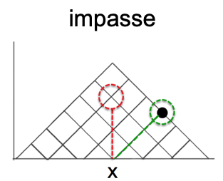

*The purpose of this notebook is to analyze _participant-level data_ collected for study SGC-3: The Insight Hypothesis *

TODO QUESTIONS: 
1. The main accuracy score is very much not a normal distribution. What is the most appropriate distribution to use to model these data? 
2. Is the linear regression a good enough fit?

```{r SETUP, include=FALSE}
knitr::opts_chunk$set(echo = TRUE, warning = FALSE, message = FALSE) 

#IMPORT LIBRARIES
library(ggpubr) #arrange plots
# library(rmdformats)
library(dplyr) #tidyverse data handling
# library(tables) # pretty tables
library(pastecs) #stat.desc
library(mosaic) #simple descriptives [favstats]

library(ggplot2) #graphs
library(car) #ANOVA, qqplot
library(effectsize) #effect size
library(pwr) #power analysis

```
  
```{r IMPORT-DATA}  

#IMPORT DATA from fall and spring files
fall_participants <- "data/fall17_sgc3a_participants.csv"
spring_partcipants <- "data/spring18_sgc3a_participants.csv"
online_participants <- "data/fall21_sgc3a_participants.csv"

df_fall <- read.csv(fall_participants)
df_spring <- read.csv(spring_partcipants)
df_online <- read.csv(online_participants)

#indicate study modality
df_fall$mode <- "lab"
df_spring$mode <- "lab"
df_online$mode <- "online"

#Create combined data frame
df_subjects <- rbind(df_fall, df_spring, df_online) #, df_replication)
df_subjects$tri_min <- df_subjects$triangular_time / 1000 / 60
df_subjects$test_min <- df_subjects$tt_t / 1000 / 60
df_subjects$learn_min <- df_subjects$ts_t / 1000 / 60

#Create factors 
df_subjects <- df_subjects %>% mutate(
  subject = as.factor(subject),
  session = as.factor(session),
  term = as.factor(term),
  condition = as.factor(condition),
  explicit = as.factor(explicit),
  impasse = as.factor(impasse),
  axis = as.factor(axis)
)

df_fall <- df_subjects %>% filter(term =="fall17")
df_spring <- df_subjects %>% filter(term =="spring18")
df_online <- df_subjects %>% filter(term =="fall21")
df_lab <- df_subjects %>% filter(term != "fall21")
```

# INTRODUCTION 
Data was initially collected (in person, SONA groups in computer lab) in Fall 2017. In Spring 2018, additional data were collected after small modifications were made to the experimental platform to increase the size of multiple-choice input buttons, and to add an additional free-response question following the main task block.  In Fall 2021, the study was replicated using asynchronous, online SONA pool. 

```{r TERMS}
#MANUALLY INSPECT TERMS
df_subjects %>% group_by(term) %>% 
  dplyr::summarize(n=n())
```

SGC3-A is a 2-condition (111-control VS 121-impasse) between-subjects experiment with `r nrow(df_subjects)` participants. 



```{r CONDITIONS}
#MANUALLY INSPECT conditions
df_subjects %>% group_by(term,condition) %>% 
  summarize(n=n())
```

# DESCRIPTIVES

## Participants

```{r PARTICIPANTS}
#Describe participants
subject.stats <- rbind(
  "lab"= df_lab %>% select(age) %>% unlist() %>% favstats(),
  "online" = df_online %>% select(age) %>% unlist() %>% favstats()
) 
subject.stats$female <- c(
  (df_lab %>% filter(sex=="Female") %>% count())$n,
  (df_online %>% filter(sex=="Female") %>% count())$n
)
```

For **in-person** collection, `r subject.stats["lab",]$n` participants (`r round(subject.stats["lab",]$female/subject.stats["lab",]$n,1) * 100` % female ) undergraduate STEM majors at a public American University participated _in person_ in exchange for course credit (age: `r min(df_lab$age)` - `r max(df_lab$age)` years).  Participants were randomly assigned to one of two experimental groups. 

For **online replication** `r subject.stats["online",]$n` participants (`r round(subject.stats["online",]$female/subject.stats["online",]$n,1) * 100` % female ) undergraduate STEM majors at a public American University participated _online, asynchronously_ in exchange for course credit (age: `r min(df_online$age)` - `r max(df_online$age)` years).  Participants were randomly assigned to one of two experimental groups. 


## Response Accuracy

Response accuracy refers to how many questions the subject answers with a correct (triangular) interpretation.  

```{r DESCRIBE-SCORES}
#DESCRIBE distribution of triangular-correct scores
score.stats <- rbind(
  "lab"= favstats(df_lab$triangular_score),
  "online"= favstats(df_online$triangular_score)
)
score.stats
```

<br>
For *in person* collection, accuracy scores (n = `r score.stats["lab",]$n`) range from `r round(score.stats["lab",]$min,2)` to `r round(score.stats["lab",]$max,2)` with a mean score of (M = `r round(score.stats["lab",]$mean,2)`, SD = `r round(score.stats["lab",]$sd,2)`). 


For *online replication*, (online) accuracy scores (n = `r score.stats["online",]$n`) range from `r round(score.stats["online",]$min,2)` to `r round(score.stats["online",]$max,2)` with a mean score of (M = `r round(score.stats["online",]$mean,2)`, SD = `r round(score.stats["online",]$sd,2)`). 


```{r VIS-SCORES}
#VISUALIZE distribution of response accuracy
plab <- gf_histogram(~triangular_score, data = df_lab) %>%
  gf_vline(xintercept = score.stats["lab",]$mean, color = "black") +
  labs(title="Lab")

ponline <- gf_histogram(~triangular_score, data = df_online) %>%
  gf_vline(xintercept = score.stats["online",]$mean, color = "black") +
  labs(title="Online")

plot <-ggarrange(plab, ponline, common.legend = TRUE, nrow = 1, ncol =2)
annotate_figure(plot, top = text_grob("Score Accuracy by Study",
   color = "black", face = "bold", size = 14))

```

<br>
However, QQPlots reveal that this variable does not approximate a normal distribution. 
```{r SCORE-NORMALITY}
qqPlot(df_lab$triangular_score)
qqPlot(df_online$triangular_score)
```
<br> <span style="color: red;">TODO: These distributions are clearly not normal. Is a linear model appropriate here, or should we be using a Poisson distribution? See the [due dilligence](#score-dist).


## Response Latency

<span style="color: red;">TODO: Investigate super high and super low response times.</span>.
<span style="color: red;">TODO: Investigate appropriate models for response time data. (see: https://lindeloev.github.io/shiny-rt/) </span>.

```{r DESCRIBE-TIMES}
#DESCRIBE distribution of response time
time.stats <- rbind(
  "lab"= favstats(df_lab$tri_min),
  "online"= favstats(df_online$tri_min)
)
time.stats <- time.stats %>% select(-missing) #don't need missing column
time.stats
```
<br>
For *in person* response latency (for stimulus blocks) (n = `r time.stats["lab",]$n`) range from `r round(time.stats["lab",]$min,2)` to `r round(time.stats["lab",]$max,2)` with a mean score of (M = `r round(time.stats["lab",]$mean,2)`, SD = `r round(time.stats["lab",]$sd,2)`). 

For *online replication* (online) accuracy scores (n = `r time.stats["online",]$n`) range from `r round(time.stats["online",]$min,2)` to `r round(time.stats["online",]$max,2)` with a mean score of (M = `r round(time.stats["online",]$mean,2)`, SD = `r round(time.stats["online",]$sd,2)`). 

```{r VIS-TIMES}
#VISUALIZE distribution of response time
plab <- gf_dhistogram(~tri_min, data = df_lab) %>%
  gf_vline(xintercept = time.stats["lab",]$mean, color = "black") %>% 
  gf_fitdistr(color="red")+
  labs(title="Lab")

ponline <- gf_dhistogram(~tri_min, data = df_subjects) %>%
  gf_vline(xintercept = time.stats["online",]$mean, color = "black") %>% 
  gf_fitdistr(color="red")+
  labs(title="Online")

plot <-ggarrange(plab, ponline, common.legend = TRUE, nrow = 1, ncol =2)

annotate_figure(plot, top = text_grob("Total Time by Study",
   color = "black", face = "bold", size = 14))
```


```{r LATENCY-NORMAL}
qqPlot(df_lab$tri_min)
qqPlot(df_online$tri_min)
```

<br> <br> However, the distribution is clearly not normal, so it is appropriate to transform the response latency variable. 

#### Transform Response Latency
```{r message=FALSE, results=FALSE}

#Apply a log transform
df_lab$log_time <- log(df_lab$tri_min)
df_online$log_time <- log(df_online$tri_min)

#Calculate log transform stats
log_time.stats <- rbind(
  "lab" = favstats(~log_time, data = df_lab),
  "online" = favstats(~log_time, data = df_online))
log_time.stats

#Visualize log transformed data 
plab <- gf_dhistogram(~log_time, data = df_lab) %>%
gf_vline(xintercept = ~log_time.stats['lab',]$mean, color = "black") %>%
gf_fitdistr(color="blue") %>% 
gf_labs(title ="response latency (LOGT) (all questions)", x="Log-transform (minutes)")

ponline <- gf_dhistogram(~log_time, data = df_online) %>%
gf_vline(xintercept = ~log_time.stats['lab',]$mean, color = "black") %>%
gf_fitdistr(color="blue") %>% 
gf_labs(title ="response latency (LOGT) (all questions)", x="Log-transform (minutes)")

plot <-ggarrange(plab, ponline, common.legend = TRUE, nrow = 1, ncol =2)

annotate_figure(plot, top = text_grob("Log-Transformed Time by Study",
   color = "black", face = "bold", size = 14))

#VERIFY normality of resulting data with qqPlot
qqPlot(~log_time, data = df_lab)
qqPlot(~log_time, data = df_online)

```
<br> <span style="color: red;">TODO: The fit appears to be much better than before. Is this good enough?</span>.

# HYPOTHESIS TESTING

## Response Accuracy by Condition
The experimental hypothesis (H1) is that structuring the data to pose an impasse (condition 121) will produce significantly better performance than non-impasse (condition 111). The null hypothesis (H0) is that there will be no difference in performance between conditions.  

### [EXPLORE]

```{r DESCRIBE-ACCURACY-BY-CONDITION}
#DESCRIBE scores by condition
score.cond.stats <- rbind(
  "lab" = favstats(triangular_score ~ condition, data = df_lab),
  "online" = favstats(triangular_score ~ condition, data = df_online)
)
score.cond.stats
```
For **in person** study, participants in the impasse group had (on average) higher scores (M = `r round(score.cond.stats[2,]$mean,2)` SD = `r round(score.cond.stats[2,]$sd,2)`) than those in the non-impasse control group (M = `r round(score.cond.stats[1,]$mean,2)`, SD = `r round(score.cond.stats[1,]$sd,2)`).

For **online replication** study, participants in the impasse group had (on average) higher scores (M = `r round(score.cond.stats[4,]$mean,2)` SD = `r round(score.cond.stats[4,]$sd,2)`) than those in the non-impasse control group (M = `r round(score.cond.stats[3,]$mean,2)`, SD = `r round(score.cond.stats[3,]$sd,2)`).

```{r VIZ-SCORES-BY-CONDITION}
#VISUALIZE scores by condition
condlables <- c("111"="control", "121"="impasse")
plab <- gf_dhistogram( ~triangular_score, fill= ~condition, data = df_lab) %>% 
  gf_facet_grid(condition~., labeller=labeller(condition=condlables)) %>% 
  gf_vline(xintercept = ~mean, data = score.cond.stats[c(1:2),], color = "blue")+
  labs(title="In Person")

ponline <- gf_dhistogram( ~triangular_score, fill= ~condition, data = df_online) %>% 
  gf_facet_grid(condition~., labeller=labeller(condition=condlables)) %>% 
  gf_vline(xintercept = ~mean, data = score.cond.stats[c(3:4),], color = "blue")+
  labs(title="Online")

plot <-ggarrange(plab, ponline, legend = FALSE, nrow = 1, ncol =2)
annotate_figure(plot, top = text_grob("Score Accuracy by Condition",
   color = "black", face = "bold", size = 14))
```

```{r BOX-SCORES-BY-CONDITION}
#VISUALIZE scores by condition
plab <- gf_boxplot(triangular_score ~ condition, data=df_lab) %>% 
  gf_jitter(color=~condition, alpha=0.5) +
  labs (title = "In Person")

ponline <- gf_boxplot(triangular_score ~ condition, data = df_online) %>% 
  gf_jitter(color=~condition, alpha=0.5)+
  labs(title ="Online")

plot <-ggarrange(plab, ponline, legend = FALSE, nrow = 1, ncol =2)
annotate_figure(plot, top = text_grob("Score Accuracy by Condition",
   color = "black", face = "bold", size = 14))

```

### [LINEAR MODEL]

```{r LAB-MODEL-SCORE}

#MODEL triangular score by condition with a linear model
m1 = lm(triangular_score ~ condition, data = df_lab)
summary(m1)

#the first co-efficient represents the model estimate for the first group, the second, the difference for the second group

# partition variance with anova
# anova(m1)
# supernova(m1) #runs but doesn't knit?

#calculate effect size
eta_squared(m1, partial = FALSE)

#plot residuals
#produce residual vs. fitted plot
plot(fitted(m1), resid(m1))
abline(0,0) #add a horizontal line at 0
plot(density(resid(m1)))

```

For **in person**, a linear model predicting triangular score accuracy by condition explains approximately 7% of the variance in triangular score F(1,124) = 9.32, p < 0.05)
<span style="color: red;">TODO: Do these residuals look ok?</span>.

```{r ONLINE-MODEL-SCORE}

#MODEL triangular score by condition with a linear model
m2 = lm(triangular_score ~ condition, data = df_online)
summary(m2)

#the first co-efficient represents the model estimate for the first group, the second, the difference for the second group

# partition variance with anova
# anova(m1)
# supernova(m2) #runs but doesn't knit?

#calculate effect size
eta_squared(m2, partial = FALSE)

#plot residuals
#produce residual vs. fitted plot
plot(fitted(m2), resid(m2))
abline(0,0) #add a horizontal line at 0
plot(density(resid(m2)))

```

For **online replication**, a linear model predicting triangular score accuracy by condition explains approximately 5% of the variance in triangular score F(1,138) = 7.60, p < 0.05)
<span style="color: red;">TODO: Do these residuals look ok?</span>.

# POST-HOC EXPLORATION 

## 1. Response Accuracy
## 1.1 Learning VS Testing 
In SGC3A, participants are provided with 15 questions. For the first 5 questions, they experience a 'scaffolded' version the stimuli (control condition = 111, impasse scaffold = 121). 

What if we **only** consider the final 10 test items? Assume students have 5 questions worth of scaffolding to figure out the graph for themselves, and we only assess accuracy for the final ten items? Is our experimental hypothesis supported?

```{r TESTING}
#DESCRIBE scores by condition
test.stats <- rbind(
  "lab"= favstats(tt_n ~ condition, data = df_lab),
  "online"= favstats(tt_n ~ condition, data = df_online)
)

#VISUALIZE scores by condition
plab <- gf_boxplot(tt_n ~ condition, data=df_lab) %>% 
  gf_jitter(color=~condition, alpha=0.5)+
  labs(title="In Person")

ponline <- gf_boxplot(tt_n ~ condition, data=df_online) %>% 
  gf_jitter(color=~condition, alpha=0.5)+
  labs(title="Online")

plot <-ggarrange(plab, ponline, legend = FALSE, nrow = 1, ncol =2)
annotate_figure(plot, top = text_grob("Test Item only Score Accuracy by Condition",
   color = "black", face = "bold", size = 14))

```

```{r TEST-model-lab}

mTest = lm(tt_n ~ condition, data = df_lab)
summary(mTest)

anova(mTest)
# supernova(mTest)
```

**In person**, A linear regression model predicting score (test blocks only) from condition explained 5% of variance, F(1,124) = 7.17, p < 0.05. 

```{r TEST-model-online}

mTest = lm(tt_n ~ condition, data = df_online)
summary(mTest)

anova(mTest)
# supernova(mTest)
```
**Online**, a linear regression model predicting score (test blocks only) from condition explained 5% of variance, F(1,138) = 6.49, p < 0.05. 

## 2. Response Latency
<span style="color: red;">TODO: What are the appropriate ways to model response accuracy vs time>? Do we need to model response latency?</span>.
- https://link.springer.com/article/10.1007/s11336-016-9537-6
- https://www.frontiersin.org/articles/10.3389/fpsyg.2019.00102/full
- https://www.jean-paulfox.com/Fox/documents/Papers/2018/LNIRT-Demo.pdf

### 2.1 Response Latency vs. Accuracy

Are response time (on the triangular blocks (test and learn)) and response accuracy correlated? <br>

```{r time-accuracy}

#VISUALIZE relationship between response time and accuracy
gf_jitter(tri_min ~ triangular_score, data = df_subjects) %>% 
  gf_lm()

#VISUALIZE relationship between response time and accuracy by condition
gf_jitter(tri_min ~ triangular_score, color = ~condition, data = df_subjects) %>% 
  gf_facet_grid(~condition) %>% 
  gf_lm()

```
<br> From visual inspection, it does not *appear* that score and time and strongly correlated. 

```{r model-time-accuracy}
# 
# #simple linear model predicting triangular score from triangular time
# m1 = lm(triangular_score ~ tri_min, data = df_subjects)
# summary(m1)
# cor.test(df_subjects$triangular_score, df_subjects$tri_min)
# 
# #linear model with log-transformed triangular time
mT = lm(triangular_score ~ log_time, data = df_lab)
summary(mT)
cor.test(df_lab$triangular_score, df_lab$log_time)

```
However, a simple linear regression indicates a significant (though small) negative correlation between score accuracy and response time R = -0.19, t(124) = -2.13, p < 0.05.  

### 2.2 Response Latency by Condition

Do response times differ by condition? 

```{r messages = FALSE}

time.stats <- favstats(tri_min ~ condition, data = df_subjects)
time.stats

gf_dhistogram(~tri_min, fill = ~condition, data = df_subjects) %>% 
  gf_facet_grid(condition~.)
```
The average total response latency (entire 15 question block) for the control condition was slightly higher (M = 9.54s, SD = 3.09) than the impasse-scaffold condition (M = 8.9, 2.69s)

```{r}

#simple linear model
m1 <- lm(tri_min ~ condition, data = df_subjects)
summary(m1)

#linear model on log-transformed data 
mT <- lm(log(tri_min) ~ condition, data = df_subjects)
summary(mT)
```
The difference in average response time is not statistically significant F(1,124) = 1.28 , p > 0.05, with a linear model predicting response time from condition explaining only 1% of variance. 

### 2.3 Response Latency on Learn (v) Test

```{r message=FALSE}

#DESCRIBE distribution of learning block times scores
learn.time.stats <- favstats(df_subjects$learn_min)
learn.time.stats

#VISUALIZE distribution of learning block time
gf_dhistogram(~learn_min, data = df_subjects) %>%
  gf_vline(xintercept = mean(df_subjects$learn_min), color = "red") %>% 
  gf_labs(title = "Distribution of LEARN block response time ")

```
Total learning block times ranged from `r round(learn.time.stats$min,2)` min to `r round(learn.time.stats$max, 2)`, with M = `r round(learn.time.stats$mean, 2)`, SD = `r round(learn.time.stats$sd, 2)`. 


```{r message=FALSE}

#DESCRIBE distribution of learning block times scores
test.time.stats <- favstats(df_subjects$test_min)
test.time.stats

#VISUALIZE distribution of learning block time
gf_dhistogram(~test_min, data = df_subjects) %>%
  gf_vline(xintercept = mean(df_subjects$test_min), color = "red") %>% 
  gf_labs(title = "Distribution of TEST block response time ")

```

Total testing block times ranged from `r round(test.time.stats$min,2)` min to `r round(test.time.stats$max, 2)`, with M = `r round(test.time.stats$mean, 2)`, SD = `r round(test.time.stats$sd, 2)`. 

Is time spent on learning (v) testing blocks correlated?

```{r}

#VISUALIZE test v learning block time
gf_point(test_min ~ learn_min, color = ~condition, data = df_subjects) %>% 
  gf_facet_grid(~condition) %>% 
  gf_lm()

```


```{r}

m1 <- lm( test_min ~ learn_min , data = df_subjects)
summary(m1)
anova(m1) #supernova(m1)

cor.test(df_subjects$test_min, df_subjects$learn_min)

```
A linear model predicting test block time from learning block time reveals that learning block time explains 12% variance in testing block time (F(1,124) = 17.1, p < 0.001), with an 18s increase in testing time for every 1 minute increase in learning time. The two variables have a small, significant correlation r = 0.35, t(124) = 4.13, p < 0.001, 95% CI [0.18, 0.49]. 


# DUE DILLIGENCE

## 1. Power Analysis
What is the appropriate sample size to detect a moderate-sized effect (f = 0.25) at a 0.05 alpha level? 

```{r POWER}

#K = 2 groups, f = 0.25 is moderate effect size
pwr.anova.test(k=2,f=0.25 ,sig.level=.05, power=.8)

```
The studies should aim to have at least 60 subjects to detect a moderate sized main effect between two conditions. 

## 2. TERM-LEVEL analysis

Data from the first term only (Fall 2017) were analyzed and presented as a paper at CogSci 2019, in support of the experimental hypothesis (H1: impasse is an effective scaffold). Combined across terms, the prior analyses ALSO support the experimental hypothesis. Do the spring-only data also support the H1 hypothesis?

```{r MODELbyTerm}

#simple linear model predicting triangle score from condition for spring data only
mspring = lm(triangular_score ~ condition, data = df_subjects %>% filter(term=='fall21'))

#partition variance
anova(mspring)# supernova(m2)
confint(mspring)
```
A linear model predicting triangular_score from conditio for **only** data collected in the Spring term does **not** reveal a significant difference between conditions. However, the previous power analysis suggests that this test may be underpowered, as it includes data from only 72 subjects (total), instead of the recommended 120 (60 / group). It seems more appropriate to combine data from fall and Spring. 

## 3. Combining Fall and Spring
```{r VISbyTerm}

#VISUALIZE scores by condition
gf_dhistogram( ~triangular_score, fill= ~condition, data = df_subjects) %>%
  gf_facet_grid(condition~term) 
# 
# #VISUALIZE scores by condition
gf_boxplot(triangular_score ~ condition, data=df_subjects) %>%
  gf_facet_grid(~term) %>% 
  gf_jitter(color=~condition, alpha=0.5)
```

By visual inspection, the distribution of accuracy scores across condition appear similiar across terms. 

**It is therefore reasonable to conclude that data collected in Spring 2018 can be combined with Fall 2017.**


## Distribution of Score Variable {#score-dist}

The accuracy score variable is not normally distributed. Should we be modelling these data with an alternative distribution (such as Poisson, for count data)?
```{r}
library(fitdistrplus)

plotdist(df_fall$triangular_score, histo = TRUE, demp = TRUE)
fit_n  <- fitdist(df_fall$triangular_score, "norm")
fit_p  <- fitdist(df_fall$triangular_score, "pois")
summary(fit_n)
summary(fit_p)

gofstat(list(fit_n, fit_p), fitnames = c("norm", "pois"))
```

```{r}
par(mfrow=c(2,2))
plot.legend <- c("normal", "poisson")
denscomp(list(fit_n, fit_p), legendtext = plot.legend)
cdfcomp (list(fit_n, fit_p), legendtext = plot.legend)
qqcomp  (list(fit_n, fit_p), legendtext = plot.legend)
ppcomp  (list(fit_n, fit_p), legendtext = plot.legend)

```

### [NON LINEAR MODEL]
Try a poisson distribution, and a poisson regression
```{r MODEL-SCORE-POISSON}
m2 = glm(triangular_score ~ condition, family = poisson(link = "log"),data = df_subjects)
summary(m2)

#plot residuals
plot(fitted(m2), resid(m2))
abline(0,0) #add a horizontal line at 0
plot(density(resid(m2)))

m3 = glm(triangular_score ~ condition, family = quasipoisson(link = "log"),data = df_subjects)
summary(m3)

#plot residuals
plot(fitted(m3), resid(m3))
abline(0,0) #add a horizontal line at 0
plot(density(resid(m3)))


```
